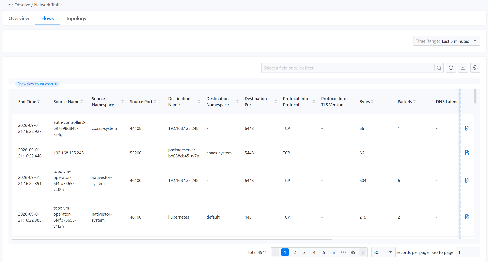
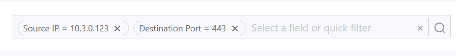
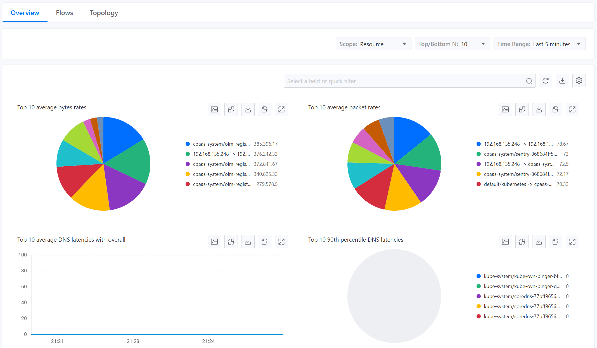
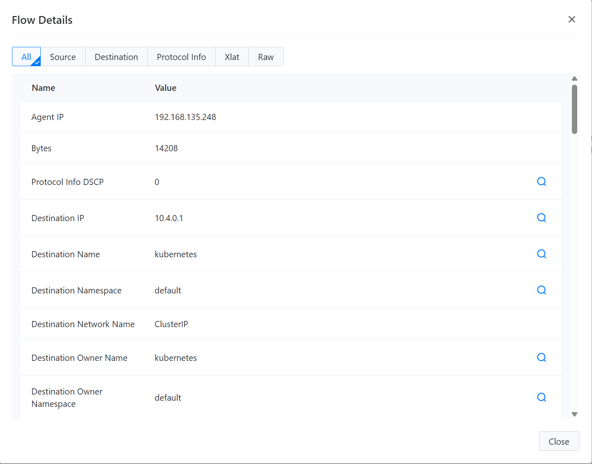
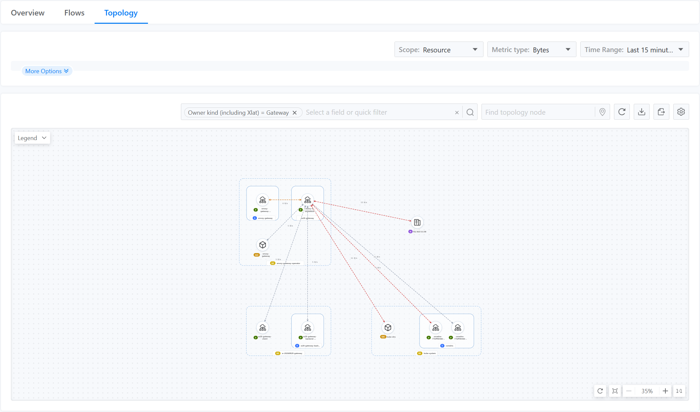

# Use the Console

After the NetObserv Operator is collecting flow logs, use the cluster console to inspect traffic overview charts, flow records, and topology.

The console plugin is enabled by default when you create a FlowCollector instance.
It adds a __Network Traffic__ page under __Observe__ in the cluster console.

Use the console when you need to:

- See where traffic is going across projects, namespaces, workloads, and nodes
- Inspect individual flow records and export them for offline analysis
- Compare traffic volume, DNS latency, TCP RTT, TLS usage, or packet drops when the corresponding eBPF features are enabled

For on-demand packet or flow capture, use the [CLI](cli-usage.mdx) instead of the console.

<!-- screenshot: docs/en/assets/netobserv-console-network-traffic.png
     capture: Network Traffic page with Overview, Flows, and Topology tabs visible.
     image:  -->

## Before You Start

Make sure that:

- You can open the target cluster in the <Term name="company"/> Container Platform console
- The NetObserv Operator is installed
- A FlowCollector instance is created and ready
- ClickHouse is reachable and is receiving flow logs

The console plugin is deployed when ClickHouse or Prometheus is enabled and `spec.consolePlugin.enable` is not set to `false`.
If __Observe__ > __Network Traffic__ is missing, confirm that the FlowCollector instance is ready and that the console plugin is enabled.

## Open Network Traffic

1. Open the target cluster in the console.

2. In the left navigation, go to __Observe__ > __Network Traffic__.

   <!-- screenshot: docs/en/assets/netobserv-console-observe-nav.png
        capture: Cluster console left navigation with Observe expanded and Network Traffic selected.
        image:  -->

3. Choose one of these tabs:

   - __Overview__: ranked charts for the current query
   - __Flows__: a paginated table of flow records
   - __Topology__: a graph of traffic between resources

The query controls under the tabs apply to the active tab.
Filters in the page header apply to Overview, Flows, and Topology at the same time.

## Set the Time Range and Filters

### Time Range

Use the __Time Range__ control on the right side of the query bar.

| Tab | Default | Presets |
| --- | --- | --- |
| Overview and Flows | Last 15 minutes | Last 5 minutes, Last 15 minutes, Last 1 hour, Last 6 hours, Custom |
| Topology | Last 5 minutes | Same presets |

If you choose __Custom__, pick a start time and end time.
The end time cannot be later than the current time.

Changing the time range reloads the active tab.

### Filters

Use the filter bar in the content header to narrow the query.

1. Click the filter bar. The placeholder is __Select a field or quick filter__.
2. Choose a field, or choose a quick filter preset.
3. Choose an operator when the field supports more than one comparison.
4. Enter or select a value, then apply the filter.

<!-- screenshot: docs/en/assets/netobserv-console-filters.png
     capture: Filter bar with a field or quick filter selected and at least one filter tag applied.
     image:  -->

Common fields include:

- Namespace, Project, Name, Owner, Kind, and Resource
- Source or destination IP, port, MAC, node, zone, and network name
- Protocol, TCP flags, DSCP, bytes, and packets
- Packet translation project fields when PacketTranslation is enabled
- DNS, Flow RTT, TLS, and packet drop fields when the matching eBPF features are enabled

Operators depend on the field type:

| Field type | Operators |
| --- | --- |
| Text | Equals, Not equals, Contains, Not contains |
| Number | Equals, Not equals, More than or equal |

Some fields can match source, destination, or either endpoint.
When the selected field supports a direction, choose __Source__, __Destination__, or __Both__ before you apply the value.

To remove a filter, clear the corresponding tag in the filter bar.

### Quick Filters

Quick filter presets come from the FlowCollector configuration and appear in the same filter bar.
Selecting a preset adds its conditions to the current filter set.
Presets are not applied until you select them.

The default presets are:

| Preset | Matches |
| --- | --- |
| Applications | Application-layer traffic |
| Infrastructure | Infrastructure-layer traffic |
| Pods network | Pod-to-pod traffic |
| Services network | Traffic whose destination is a Service |
| External ingress | Ingress from external addresses |
| External egress | Egress to external addresses |

If results look too narrow after you select Applications or Pods network, clear those tags.

## Overview

Use the Overview tab to compare the busiest endpoints in the selected time range.

<!-- screenshot: docs/en/assets/netobserv-console-overview.png
     capture: Overview tab with Resource scope, Top 10, Last 15 minutes, and the default byte and packet rate panels.
     image:  -->

The default Overview query uses:

- Scope: Resource
- Top N: 10
- Datasource: ClickHouse, or Auto when more than one datasource is available
- Time range: Last 15 minutes

If Auto is available, it chooses ClickHouse or Prometheus based on backend availability.

### Overview Query Controls

| Control | What it changes |
| --- | --- |
| Record type | Shown only when more than one log type is configured. The default is Flow logs. |
| Drops | Shown only when packet drop tracking is enabled. The default is All. |
| Datasource | Auto, ClickHouse, or Prometheus, when more than one datasource is available. |
| Scope | Cluster, Network, Zone, Node, Project, Namespace, Owner, or Resource. Available values follow the plugin configuration. |
| Top N | 5, 10, or 15. The default is 10. |
| Time Range | The window used to rank and chart the selected scope. |

### Overview Header Actions

On the right side of the Overview header:

1. Click the refresh icon to reload the panels.
2. Click the download icon to export the current panel data.
3. Click the gear icon to open __Manage Panels__.

### Manage Panels

<!-- screenshot: docs/en/assets/netobserv-console-manage-panels.png
     capture: Manage Panels dialog with category filters, Show checkboxes, and Save.
     image:  -->

1. Click the gear icon.
2. Filter the list by category and statistic, for example Traffic, DNS, TCP RTT, TLS, Packet Drops, or Custom.
3. Select the panels to show. At least one panel must remain visible.
4. Drag a row to change the panel order.
5. Click the reset icon if you want to restore the default panel set.
6. Click __Save__. Click __Cancel__ to discard the changes.

Default traffic panels include top average byte rates and top average packet rates.
Additional panels appear only when the matching eBPF feature is enabled:

| Feature | Example panels |
| --- | --- |
| Packet drop tracking (`pktDrop`) | Top dropped byte and packet rates, drop state, and drop cause |
| DNS tracking (`DNSTracking`) | DNS latency percentiles, DNS names, and DNS response codes |
| Flow RTT (`FlowRTT`) | Minimum, average, maximum, P90, and P99 TCP RTT |
| TLS tracking (`TLSTracking`) | TLS usage, version, group, and cipher suite |

## Flows

Use the Flows tab to inspect individual flow records.

<!-- screenshot: docs/en/assets/netobserv-console-flows.png
     capture: Flows table with the foldable flow-count chart, default columns, and pagination.
     image:  -->

The default Flows query uses:

- Record type: Flow logs, unless conversation tracking is also configured
- Packet drop filter: All
- Time range: Last 15 minutes
- Page size: 50 records

### Flows Query Controls

The record type and packet drop controls are shown only when more than one option is available.

If packet drop tracking is enabled, the __Drops__ control can limit the table to:

- All
- Sent
- Has drops
- Dropped

### Flow Count Chart

Above the table, a foldable chart shows the number of flows in the selected time range.
The title includes the total count for that window.

Use the expand and collapse hint to show or hide the chart.
Hiding the chart does not change the table query.

### Flow Table Columns

Default columns include:

- End Time
- Event / Type
- Conversation Id
- Source name, namespace, port, and network name
- Destination name, namespace, port, and network name

Use __Manage Columns__ to show additional columns such as Project, owner, node, zone, protocol, bytes, packets, DNS, RTT, TLS, or packet drop fields.

<!-- screenshot: docs/en/assets/netobserv-console-manage-columns.png
     capture: Manage Columns dialog with All/Source/Destination groups, Show checkboxes, and Save.
     image:  -->

1. Click the gear icon in the Flows header.
2. Choose a column group such as All, Source, Destination, or Time.
3. Select the columns to display. At least one column must remain visible.
4. Drag a row to change the column order.
5. Click __Save__. Click __Cancel__ to discard the changes.

### Flow Details

To inspect one record:

1. Click the details action on the row.
2. Review the field table. The default group is __All__.
3. Choose a group such as Source or Destination to focus the list.
4. Click the magnifier icon on a field to add that field as a filter and close the dialog.
5. Choose __Raw__ to view the read-only JSON record.
6. Click __Close__ when you finish.

<!-- screenshot: docs/en/assets/netobserv-console-flow-details.png
     capture: Flow Details dialog with All/Source/Destination/Raw groups and the add-filter action.
     image:  -->

### Export and Pagination

To export the current query, click __Export CSV__ in the Flows header.
The export uses the current filters, time range, and query.
It does not include a full-table count.

Use the paginator under the table to change pages or the page size.
Available page sizes are 50, 100, 500, and 1000.

A back-to-top control appears after you scroll the table.

## Topology

Use the Topology tab to see how traffic moves between endpoints.

<!-- screenshot: docs/en/assets/netobserv-console-topology.png
     capture: Resource-scope topology with edges visible, Bytes metric, and the node search box.
     image:  -->

The default Topology query uses:

- Scope: Resource
- Metric type: Bytes
- Metric function: Latest rate
- Groups: Auto
- Layout: ColaNoForce
- Datasource: Auto
- Time range: Last 5 minutes

### Topology Query Controls

Choose a scope first.
Available scopes include Cluster, Network, Zone, Node, Project, Namespace, Owner, and Resource.

Then choose the metric type:

- Bytes
- Packets
- Dropped bytes or dropped packets, when packet drop tracking is enabled
- DNS latencies, when DNS tracking is enabled
- Flow RTT, when Flow RTT tracking is enabled

Open __More Options__ to change:

| Control | Options |
| --- | --- |
| Layout | ColaNoForce (default), BreadthFirst, Cola, Dagre, Force, Grid |
| Groups | Auto, None, or a combination allowed by the current scope |
| Metric function | Latest rate, Average, Minimum, Maximum, Sum, P90, P99 |
| Datasource | Auto, ClickHouse, or Prometheus, when more than one datasource is available |
| Record type | Shown only when both conversation and flow log types are configured |

Grouping options depend on the current scope.
When Project is available, Auto grouping uses Project, then Namespace, then Owner for workload scopes.

### Topology Header Actions

Use the topology header to:

- Search for a node name
- Refresh the graph
- Download the current topology data
- Export a PNG image of the canvas
- Open topology settings and choose whether to show edges and edge labels

Edge labels require edges to be visible.

<!-- screenshot: docs/en/assets/netobserv-console-topology-settings.png
     capture: Topology settings with Show edges and Show labels.
     image:  -->

Click a node or edge to add a filter, then continue the investigation in Overview or Flows.

## Feature-Dependent Data

The console shows extra fields, panels, and metrics only when the FlowCollector enables the matching feature.
The example FlowCollector in [Deploy with the Operator](../install/operator-deployment.mdx) enables:

- `DNSTracking`
- `FlowRTT`
- `PacketTranslation`
- `TLSTracking`

| Feature | Extra console data |
| --- | --- |
| `DNSTracking` | DNS filters, columns, Overview panels, and topology DNS latency metric |
| `FlowRTT` | Flow RTT filters, columns, Overview panels, and topology RTT metric |
| `TLSTracking` | TLS filters, columns, and Overview TLS panels |
| `PacketTranslation` | Packet translation project fields and filters |
| `pktDrop` | Drops query control, drop columns, drop panels, and dropped-byte or dropped-packet topology metrics |

Conversation record types require conversation log types in the FlowCollector processor configuration.
If a panel, column, or metric is missing, check the FlowCollector feature list rather than the console page settings.

## Empty or Incomplete Results

If Network Traffic shows no data:

1. Widen the time range and remove extra filters.
2. Confirm that the FlowCollector instance is ready and that eBPF agents are running.
3. Confirm that ClickHouse is enabled and receiving new flow logs.
4. If you expected DNS, RTT, TLS, or drop data, confirm that the matching eBPF feature is enabled.

If the page is missing from the console, confirm that the console plugin is enabled and that the FlowCollector instance is ready.
